# CKD 환자에서 CLI/PAD 유무에 따른 변수 분석

## Table of Contents

* [데이터전처리](#데이터-전처리)
* [데이터 탐색](#데이터-탐색)
    * [Demographic Data](#Demographic-data)
* [분석1 : CLI 에 따른 demographic data 비교 검정](#분석-1)
* [분석2 : CLI 에 따른 lab data 비교 검정](#분석-2)
* [분석3 : PAD 에 따른 lab data 비교 검정](#분석-3)
* [분석4 : CKD 수준별 CLI 에 따른 lab data 비교 검정](#분석-4)

### Study group의 구분
Column G 는 CKD without CLI 인 환자 및 CKD with CLI 환자를 구분한 Group 입니다.
- Group 3: CKD 3 without CLI
- Group 4: CKD 4 without CLI
- Group 5: CKD 5 without CLI 
- Group 6: CKD 3 with CLI
- Group 7: CKD 4 with CLI
- Group 8: CKD 5 with CLI 

#### 1) 분석 1 

CLI 유무에 따른 demographic data (Gender, Age, DM, HTN, ACS, CHF, CVA, Smoking, Alcohol, BMI, Statin 복용) 의 차이를 보는 것이 분석 1 입니다.  

즉 [Group 3+4+5]와 [Group 6+7+8] 의 상기 변수의 차이를 통계적으로 분석하는 것이 필요합니다. 

#### 2) 분석 2

CLI 유무에 따른 lab data (Average CFU, VEGF, VEGF/CD34, CD34, SDF-1, VEGF) 의 차이를 보는 것이 분석 2 입니다.

즉 [Group 3+4+5]와 [Group 6+7+8] 의 상기 변수의 차이를 통계적으로 분석하는 것이 필요합니다. 

#### 3) 분석 3

PAD 유무에 따른 lab data (Average CFU, VEGF, VEGF/CD34, CD34, SDF-1, VEGF) 의 차이를 보는 것이 분석 3 입니다.
Column R은 PAD 유무를 표시하고 있습니다. 0 = None, 1= Exist 입니다. 

#### 4) 분석 4 

같은 CKD stage 지만 CLI 유무에 따라 lab data  (Average CFU, VEGF, VEGF/CD34, CD34, SDF-1, VEGF) 의 차이를 보는 것이 분석 4 입니다.
- Group 3 vs Group 6
- Group 4 vs Group 7
- Group 5 vs Group 8 

---
## 데이터 전처리


```R
# 데이터 불러오기
library(xlsx)
data <- read.xlsx("EPCinCKD_201802.xlsx", sheetIndex = 1)
# 필요한 데이터만 추출(이름, ID 제거, 150행까지)
data <- data[1:150,-c(1,2)]
```


```R
# Column name 변경
colnames(data)[c(7, 13, 15, 16, 22)] <- c("HTN", "statin", "obesity", "PAD", "CD34.All")

head(data)
tail(data)
colnames(data)
```


<table>
<thead><tr><th scope=col>Gender</th><th scope=col>Age</th><th scope=col>Birth.Date</th><th scope=col>CKD.class</th><th scope=col>Group</th><th scope=col>DM</th><th scope=col>HTN</th><th scope=col>ACS</th><th scope=col>CHF</th><th scope=col>CVA</th><th scope=col>⋯</th><th scope=col>obesity</th><th scope=col>PAD</th><th scope=col>Average.CFU</th><th scope=col>VEGF</th><th scope=col>CD34.VEGF</th><th scope=col>CD34</th><th scope=col>VEGF.All</th><th scope=col>CD34.All</th><th scope=col>VEGF.1</th><th scope=col>SDF.1</th></tr></thead>
<tbody>
	<tr><td>0         </td><td>49.00000  </td><td>1961-10-12</td><td>3         </td><td>3         </td><td>0         </td><td>1         </td><td>0         </td><td>0         </td><td>0         </td><td>⋯         </td><td>0         </td><td>0         </td><td>3.789457  </td><td> 1.450    </td><td>0.1900    </td><td> 2.1000   </td><td> 1.6400   </td><td>2.2900    </td><td> 31.432   </td><td>1933.688  </td></tr>
	<tr><td>0         </td><td>64.63611  </td><td>1946-11-05</td><td>3         </td><td>3         </td><td>0         </td><td>1         </td><td>0         </td><td>0         </td><td>1         </td><td>⋯         </td><td>0         </td><td>0         </td><td>4.392872  </td><td> 6.674    </td><td>0.1645    </td><td>-0.0390   </td><td> 6.8385   </td><td>0.1255    </td><td>  2.563   </td><td>2139.464  </td></tr>
	<tr><td>0         </td><td>38.88056  </td><td>1972-03-02</td><td>3         </td><td>3         </td><td>0         </td><td>0         </td><td>0         </td><td>0         </td><td>0         </td><td>⋯         </td><td>0         </td><td>0         </td><td>3.704475  </td><td> 7.654    </td><td>0.1715    </td><td> 0.4345   </td><td> 7.8255   </td><td>0.6060    </td><td> 54.338   </td><td>3092.584  </td></tr>
	<tr><td>1         </td><td>61.50000  </td><td>1949-12-08</td><td>3         </td><td>3         </td><td>1         </td><td>1         </td><td>0         </td><td>0         </td><td>0         </td><td>⋯         </td><td>1         </td><td>1         </td><td>6.167245  </td><td>12.907    </td><td>0.1740    </td><td> 0.2595   </td><td>13.0810   </td><td>0.4335    </td><td> 38.010   </td><td>1877.869  </td></tr>
	<tr><td>1         </td><td>69.29722  </td><td>1942-05-07</td><td>3         </td><td>3         </td><td>0         </td><td>1         </td><td>0         </td><td>0         </td><td>0         </td><td>⋯         </td><td>1         </td><td>1         </td><td>5.879595  </td><td> 2.887    </td><td>0.4690    </td><td>-0.0955   </td><td> 3.3560   </td><td>0.3735    </td><td> 81.725   </td><td>1902.396  </td></tr>
	<tr><td>1         </td><td>74.65000  </td><td>1936-11-29</td><td>3         </td><td>3         </td><td>0         </td><td>1         </td><td>0         </td><td>0         </td><td>0         </td><td>⋯         </td><td>0         </td><td>0         </td><td>3.929069  </td><td> 5.296    </td><td>0.1880    </td><td> 0.1035   </td><td> 5.4840   </td><td>0.2915    </td><td>195.327   </td><td>2223.454  </td></tr>
</tbody>
</table>


<table>
<thead><tr><th></th><th scope=col>Gender</th><th scope=col>Age</th><th scope=col>Birth.Date</th><th scope=col>CKD.class</th><th scope=col>Group</th><th scope=col>DM</th><th scope=col>HTN</th><th scope=col>ACS</th><th scope=col>CHF</th><th scope=col>CVA</th><th scope=col>⋯</th><th scope=col>obesity</th><th scope=col>PAD</th><th scope=col>Average.CFU</th><th scope=col>VEGF</th><th scope=col>CD34.VEGF</th><th scope=col>CD34</th><th scope=col>VEGF.All</th><th scope=col>CD34.All</th><th scope=col>VEGF.1</th><th scope=col>SDF.1</th></tr></thead>
<tbody>
	<tr><th scope=row>145</th><td>0         </td><td>56        </td><td>1954-07-15</td><td>5         </td><td>8         </td><td>1         </td><td>1         </td><td>1         </td><td>0         </td><td>0         </td><td>⋯         </td><td>0         </td><td>0         </td><td>3.044     </td><td>0.3865    </td><td>0.0875    </td><td> 0.0035   </td><td>0.4740    </td><td> 0.0910   </td><td>231.768   </td><td>4313.722  </td></tr>
	<tr><th scope=row>146</th><td>1         </td><td>63        </td><td>1947-06-15</td><td>5         </td><td>8         </td><td>1         </td><td>0         </td><td>0         </td><td>0         </td><td>0         </td><td>⋯         </td><td>1         </td><td>1         </td><td>5.090     </td><td>4.1670    </td><td>0.2255    </td><td>-0.0055   </td><td>4.3925    </td><td> 0.2200   </td><td>495.291   </td><td>5311.477  </td></tr>
	<tr><th scope=row>147</th><td>0         </td><td>71        </td><td>1938-11-08</td><td>5         </td><td>8         </td><td>1         </td><td>1         </td><td>0         </td><td>0         </td><td>0         </td><td>⋯         </td><td>1         </td><td>1         </td><td>5.690     </td><td>1.2190    </td><td>0.1255    </td><td> 0.1955   </td><td>1.3445    </td><td> 0.3210   </td><td> 62.777   </td><td>3311.798  </td></tr>
	<tr><th scope=row>148</th><td>0         </td><td>70        </td><td>1940-01-20</td><td>5         </td><td>8         </td><td>1         </td><td>1         </td><td>1         </td><td>0         </td><td>1         </td><td>⋯         </td><td>1         </td><td>1         </td><td>5.554     </td><td>1.7870    </td><td>0.0795    </td><td>-0.0045   </td><td>1.8665    </td><td> 0.0750   </td><td>277.927   </td><td>7015.030  </td></tr>
	<tr><th scope=row>149</th><td>1         </td><td>71        </td><td>1940-10-08</td><td>5         </td><td>8         </td><td>1         </td><td>1         </td><td>0         </td><td>0         </td><td>0         </td><td>⋯         </td><td>0         </td><td>0         </td><td>3.684     </td><td>2.1200    </td><td>2.6090    </td><td>10.3900   </td><td>4.7290    </td><td>12.9990   </td><td>500.290   </td><td>3461.473  </td></tr>
	<tr><th scope=row>150</th><td>1         </td><td>48        </td><td>1961-01-15</td><td>5         </td><td>8         </td><td>1         </td><td>1         </td><td>0         </td><td>0         </td><td>0         </td><td>⋯         </td><td>0         </td><td>0         </td><td>4.980     </td><td>0.3135    </td><td>0.2670    </td><td> 0.0425   </td><td>0.5805    </td><td> 0.3095   </td><td>     NA   </td><td>      NA  </td></tr>
</tbody>
</table>


<ol class=list-inline>
	<li>'Gender'</li>
	<li>'Age'</li>
	<li>'Birth.Date'</li>
	<li>'CKD.class'</li>
	<li>'Group'</li>
	<li>'DM'</li>
	<li>'HTN'</li>
	<li>'ACS'</li>
	<li>'CHF'</li>
	<li>'CVA'</li>
	<li>'smoking'</li>
	<li>'alcohol'</li>
	<li>'statin'</li>
	<li>'BMI'</li>
	<li>'obesity'</li>
	<li>'PAD'</li>
	<li>'Average.CFU'</li>
	<li>'VEGF'</li>
	<li>'CD34.VEGF'</li>
	<li>'CD34'</li>
	<li>'VEGF.All'</li>
	<li>'CD34.All'</li>
	<li>'VEGF.1'</li>
	<li>'SDF.1'</li>
</ol>


```R
# 범주형 변수, 데이터 타입 변경
# data$Gender <- factor(data$Gender, levels=c(0,1), labels =c("F","M"))

# for( key in c('DM', 'HTN', 'ACS', 'CHF', 'CVA', 'smoking', 'alcohol', 'statin', 'obesity', 'PAD') ){
#     data[key][,1] <- factor(data[key][,1])
# }
```


```R
library(dplyr)

# CLI 변수 생성 : 0 = CLI 없음(Group3,4,5) / 1 = CLI 있음(Group6,7,8)
data <- data %>% mutate( CLI = as.numeric(Group>=5))
```

----
## 데이터 탐색


### Demographic data 

CLI 유무를 기준으로 나눈 집단에서 

Gender, Age, DM, HTN, ACS, CHF, CVA, Smoking, Alcohol, BMI, Statin 확인


```R
# CLI 데이터 수 
cat( "\nCLI(group6+7+8) number : ", sum(data$CLI), "/ ", length(data$CLI),"\n")


library(dplyr)

# Demographic data
cat("\n\n<CLI 그룹에 따른 Demographic data 비교>\n")
data %>% 
    group_by( CLI ) %>%
    summarise( gender.ratio = mean(Gender, na.rm = T),
            mean.Age = mean(Age, na.rm = T),
            DM.ratio = mean(DM, na.rm = T),
            HTN.ratio = mean(HTN, na.rm = T),
            ACS.ratio = mean(ACS, na.rm = T),
            CHF.ratio = mean(CHF, na.rm = T),
            CVA.ratio = mean(CVA, na.rm = T),
            smoking.ratio = mean(smoking, na.rm = T),
            alcohol.ratio = mean(alcohol, na.rm = T),
            statin.ratio = mean(statin, na.rm = T),
            mean.BMI = mean(BMI, na.rm = T),
            obesity.ratio = mean(obesity, na.rm = T),
            PAD.ratio = mean(PAD, na.rm = T)
             ) %>%
    mutate_if(is.numeric, funs(round(., 2)))

```

    
    CLI(group6+7+8) number :  67 /  150 
    
    
    <CLI 그룹에 따른 Demographic data 비교>


<table>
<thead><tr><th scope=col>CLI</th><th scope=col>gender.ratio</th><th scope=col>mean.Age</th><th scope=col>DM.ratio</th><th scope=col>HTN.ratio</th><th scope=col>ACS.ratio</th><th scope=col>CHF.ratio</th><th scope=col>CVA.ratio</th><th scope=col>smoking.ratio</th><th scope=col>alcohol.ratio</th><th scope=col>statin.ratio</th><th scope=col>mean.BMI</th><th scope=col>obesity.ratio</th><th scope=col>PAD.ratio</th></tr></thead>
<tbody>
	<tr><td>0    </td><td>0.57 </td><td>65.13</td><td>0.42 </td><td>0.94 </td><td>0.12 </td><td>0.01 </td><td>0.16 </td><td>0.59 </td><td>0.33 </td><td>0.60 </td><td>24.30</td><td>0.41 </td><td>0.40 </td></tr>
	<tr><td>1    </td><td>0.63 </td><td>63.32</td><td>0.69 </td><td>0.81 </td><td>0.23 </td><td>0.08 </td><td>0.09 </td><td>0.36 </td><td>0.08 </td><td>0.22 </td><td>23.21</td><td>0.35 </td><td>0.34 </td></tr>
</tbody>
</table>


1.5배~2배 정도: DM, smoking, ACS, CVA 

2배 이상:  CHF, alcohol, statin 

차이가 있어 보이는 후보군은 위와 같다. 

#### Age 와 BMI 의 분포 확인 


```R
# 연속형 데이터 분포 확인
library(repr)
library(ggplot2)
options(repr.plot.width=4.5, repr.plot.height=2.5)

# CLI 집단에 따른 Age 분포 확인 
data %>% 
    ggplot(aes(x=Age)) +
    geom_histogram(bins=30, na.rm = T) +  
    ggtitle("Age in noCLI / CLI") +
    labs(x="Age", y="Freq") +
    theme(plot.title = element_text(hjust = 0.5)) + 
    facet_wrap(~ CLI)

# 겹친 그래프
# data %>% 
#     mutate(CLI.f = as.factor(CLI)) %>%
#     ggplot(aes(x=Age, fill = CLI.f)) +
#     geom_histogram(alpha=0.5, position="identity", binwidth = 2.5) +  
#     ggtitle("Age in noCLI / CLI") +
#     labs(x="Age", y="Freq") +
#     theme(plot.title = element_text(hjust = 0.5))

# CLI 집단에 따른 BMI 분포 확인
data %>% 
    ggplot(aes(x=BMI)) +
    geom_histogram(bins=30, na.rm = T) +  
    ggtitle("BMI in noCLI / CLI") +
    labs(x="BMI", y="Freq") +
    theme(plot.title = element_text(hjust = 0.5)) + 
    facet_wrap(~ CLI)

# 겹친 그래프
# data %>% 
#     mutate(CLI.f = as.factor(CLI)) %>%
#     ggplot(aes(x=BMI, fill = CLI.f)) +
#     geom_histogram(alpha=0.5, position="identity",binwidth = 1) +  
#     ggtitle("BMI in noCLI / CLI") +
#     labs(x="BMI", y="Freq") +
#     theme(plot.title = element_text(hjust = 0.5))
```


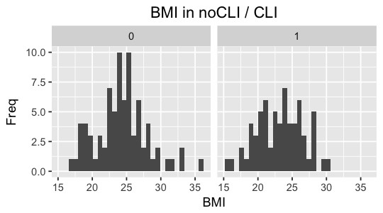


CLI 그룹과 비 CLI 그룹에서 분포의 큰 차이는 없어보인다. 

### Lab data

CLI 혹은 PAD 유무를 기준으로 나눈 집단에서 

Average CFU, VEGF, VEGF/CD34, CD34, SDF-1, VEGF 수치 확인


```R
# CLI 그룹별 비교

cat("\n<CLI 그룹에 따른 Lab data 비교>\n")
data %>% 
    group_by( CLI ) %>%
    summarise( mean.Average.CFU = mean(Average.CFU, na.rm = T),
            mean.VEGF = mean(VEGF, na.rm = T),
            mean.CD34 = mean(CD34, na.rm = T),
            mean.VEGF.All = mean(VEGF.All, na.rm = T),
            mean.CD34.All = mean(CD34.All, na.rm = T),
            mean.VEGF.1 = mean(VEGF.1, na.rm = T),
            mean.SDF.1 = mean(SDF.1, na.rm = T)
             ) %>%
    mutate_if(is.numeric, funs(round(., 2)))
```

    
    <CLI 그룹에 따른 Lab data 비교>


<table>
<thead><tr><th scope=col>CLI</th><th scope=col>mean.Average.CFU</th><th scope=col>mean.VEGF</th><th scope=col>mean.CD34</th><th scope=col>mean.VEGF.All</th><th scope=col>mean.CD34.All</th><th scope=col>mean.VEGF.1</th><th scope=col>mean.SDF.1</th></tr></thead>
<tbody>
	<tr><td>0      </td><td>5.26   </td><td>6.32   </td><td>0.11   </td><td>6.63   </td><td>0.41   </td><td> 66.85 </td><td>2390.31</td></tr>
	<tr><td>1      </td><td>4.91   </td><td>3.37   </td><td>0.50   </td><td>3.69   </td><td>0.82   </td><td>123.24 </td><td>3260.86</td></tr>
</tbody>
</table>


CFU 를 제외한 값들이 꽤 차이나보인다. 


```R
# 각각의 값에 대한 그래프 그리기

for(key in c('Average.CFU', 'VEGF', 'CD34.VEGF', 'CD34', 'VEGF.All', 'CD34.All', 'VEGF.1', 'SDF.1')){

    p<- data %>% 
        mutate(CLI.f = as.factor(CLI)) %>%
        ggplot(aes_string(x=key, fill = "CLI.f")) +
        geom_histogram(alpha=0.5, position="identity",bins = 30, na.rm = T) +  
        ggtitle(paste(key, " in noCLI / CLI")) +
        labs(x=key, y="Freq") +
        theme(plot.title = element_text(hjust = 0.5))
    
    print(p)
}


```


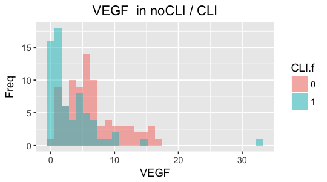


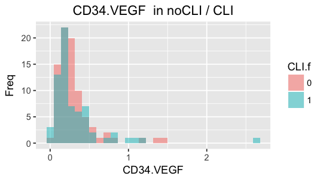


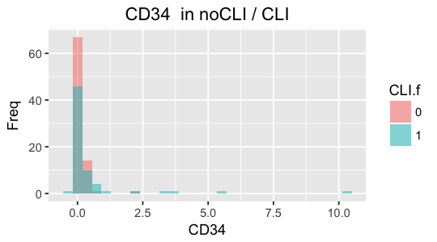


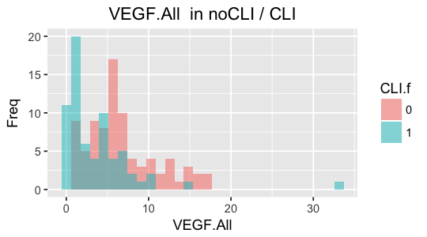


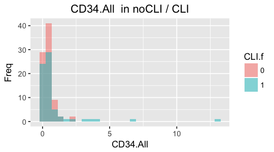


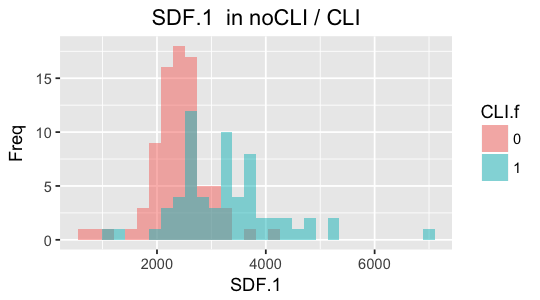


```R
# PAD 그룹 별 비교 

cat("\n<PAD 그룹에 따른 Lab data 비교>\n")
data %>% 
    group_by( PAD ) %>%
    summarise( mean.Average.CFU = mean(Average.CFU, na.rm = T),
            mean.VEGF = mean(VEGF, na.rm = T),
            mean.CD34 = mean(CD34, na.rm = T),
            mean.VEGF.All = mean(VEGF.All, na.rm = T),
            mean.CD34.All = mean(CD34.All, na.rm = T),
            mean.VEGF.1 = mean(VEGF.1, na.rm = T),
            mean.SDF.1 = mean(SDF.1, na.rm = T)
             ) %>%
    mutate_if(is.numeric, funs(round(., 2)))
```

    
    <PAD 그룹에 따른 Lab data 비교>


<table>
<thead><tr><th scope=col>PAD</th><th scope=col>mean.Average.CFU</th><th scope=col>mean.VEGF</th><th scope=col>mean.CD34</th><th scope=col>mean.VEGF.All</th><th scope=col>mean.CD34.All</th><th scope=col>mean.VEGF.1</th><th scope=col>mean.SDF.1</th></tr></thead>
<tbody>
	<tr><td>0      </td><td>4.50   </td><td>4.63   </td><td>0.42   </td><td>4.96   </td><td>0.75   </td><td>92.25  </td><td>2861.71</td></tr>
	<tr><td>1      </td><td>6.11   </td><td>5.63   </td><td>0.05   </td><td>5.91   </td><td>0.33   </td><td>89.83  </td><td>2611.55</td></tr>
</tbody>
</table>


CD34가 크게 차이나보인다. 


```R
# 각각의 분포를 그려보기

for(key in c('Average.CFU', 'VEGF', 'CD34.VEGF', 'CD34', 'VEGF.All', 'CD34.All', 'VEGF.1', 'SDF.1')){

    p<- data %>% 
        mutate(PAD.f = as.factor(PAD)) %>%
        ggplot(aes_string(x=key, fill = "PAD.f")) +
        geom_histogram(alpha=0.5, position="identity",bins = 30, na.rm = T) +  
        ggtitle(paste(key, " in noCLI / CLI")) +
        labs(x=key, y="Freq") +
        theme(plot.title = element_text(hjust = 0.5))
    
    print(p)
}
```


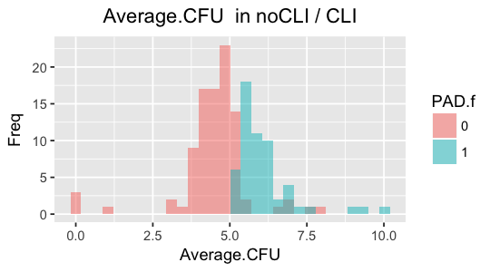


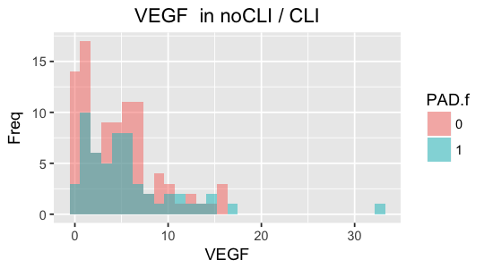


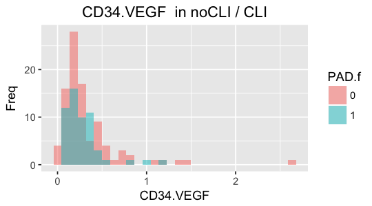


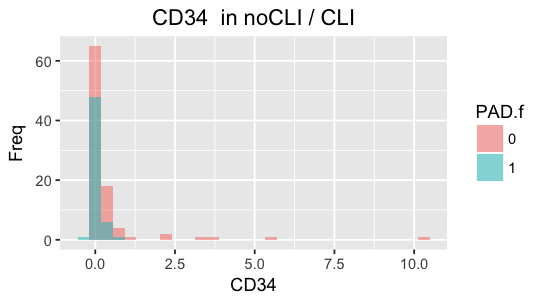


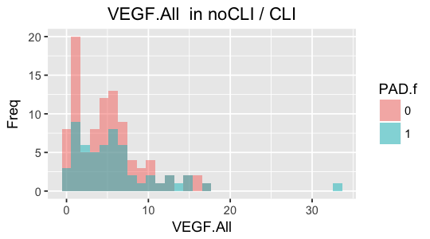


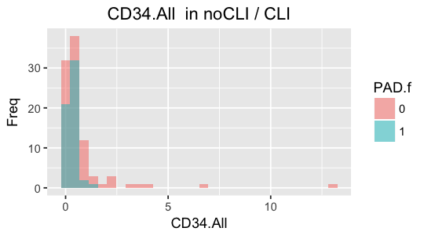


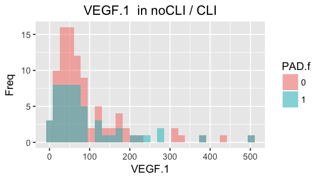


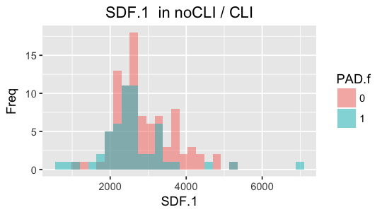


---
## 분석 1

### CLI 집단과 비 CLI 집단 사이의 demographic 수치 비교

범주형 : Gender, DM, HTN, ACS, CHF, CVA, Smoking, Alcohol, obesity(BMI 기준 비만여부), Statin
    
    => Chi-square 분석

연속형 : Age, BMI

    => t-test 
    
다중분석이기 때문에 보정해야할 것 같은데, 방법좀 찾아봐야할듯
t-test 는 개수가 많아서 딱히 wilcoxon 안해도 될듯..? : 확인


```R
for(key in c("DM", "HTN", "ACS", "CHF", "CVA", "smoking", "alcohol", "statin", "obesity", "PAD")){
    test <- chisq.test(data[key][,1], data["CLI"][,1])
    cat("\n", key, "~ CLI result : ", "\n   statistics = ", test$statistic, "\n   p-value = ", test$p.value, '\n')
}

```

    
     DM ~ CLI result :  
       statistics =  8.86614 
       p-value =  0.002905088 
    
     HTN ~ CLI result :  
       statistics =  4.202779 
       p-value =  0.04035779 
    
     ACS ~ CLI result :  
       statistics =  2.523011 
       p-value =  0.1121962 


    Warning message in chisq.test(data[key][, 1], data["CLI"][, 1]):
    “Chi-squared approximation may be incorrect”

    
     CHF ~ CLI result :  
       statistics =  2.116435 
       p-value =  0.1457254 
    
     CVA ~ CLI result :  
       statistics =  0.7167251 
       p-value =  0.3972202 
    
     smoking ~ CLI result :  
       statistics =  7.533263 
       p-value =  0.02312984 


    Warning message in chisq.test(data[key][, 1], data["CLI"][, 1]):
    “Chi-squared approximation may be incorrect”

    
     alcohol ~ CLI result :  
       statistics =  12.36015 
       p-value =  0.002070273 
    
     statin ~ CLI result :  
       statistics =  20.11862 
       p-value =  7.278468e-06 
    
     obesity ~ CLI result :  
       statistics =  0.3852833 
       p-value =  0.5347892 
    
     PAD ~ CLI result :  
       statistics =  0.2640427 
       p-value =  0.6073563 


```R
fisher.test(data$CHF, data$CLI)
fisher.test(data$alcohol, data$CLI)
```


    
    	Fisher's Exact Test for Count Data
    
    data:  data$CHF and data$CLI
    p-value = 0.09445
    alternative hypothesis: true odds ratio is not equal to 1
    95 percent confidence interval:
       0.6677119 300.0724560
    sample estimates:
    odds ratio 
      6.198417 


    
    	Fisher's Exact Test for Count Data
    
    data:  data$alcohol and data$CLI
    p-value = 0.0006257
    alternative hypothesis: two.sided


```R
t.test(Age~CLI, data = data)
t.test(BMI~CLI, data = data)
```


    
    	Welch Two Sample t-test
    
    data:  Age by CLI
    t = 1.1076, df = 142.64, p-value = 0.2699
    alternative hypothesis: true difference in means is not equal to 0
    95 percent confidence interval:
     -1.419474  5.037123
    sample estimates:
    mean in group 0 mean in group 1 
           65.13076        63.32193 


    
    	Welch Two Sample t-test
    
    data:  BMI by CLI
    t = 1.8933, df = 143.08, p-value = 0.06033
    alternative hypothesis: true difference in means is not equal to 0
    95 percent confidence interval:
     -0.04826811  2.24077204
    sample estimates:
    mean in group 0 mean in group 1 
           24.30318        23.20693 


## 분석 2

### CLI 집단과 비CLI 집단 사이의 lab 수치 비교

Average CFU, VEGF, VEGF/CD34, CD34, SDF-1, VEGF : 연속형 데이터

    => t-test

여러가지를 비교하기 때문에 다중 분석에 대한 보정 필요할것 

흠.. 정규분포를 따르는 것 같이 안생겼으니, t-test 보다는 wilcoxon rank sum 을 해야할수도 


```R
pairwise.t.test() 
pairwise.wilcox.test() 가 나을 수도 잇겠다. 
```

## 분석 3

### PAD 집단과 비PAD 집단 사이의 lab 수치 비교


Average CFU, VEGF, VEGF/CD34, CD34, SDF-1, VEGF : 연속형 데이터

    => t-test

여러가지를 비교하기 때문에 다중 분석에 대한 보정 필요할것 


## 분석 4
